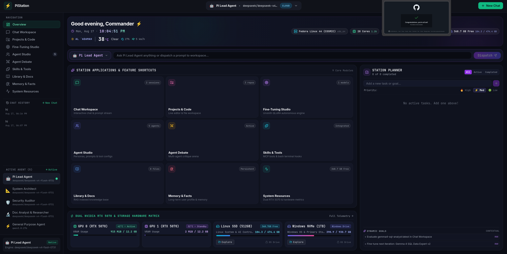
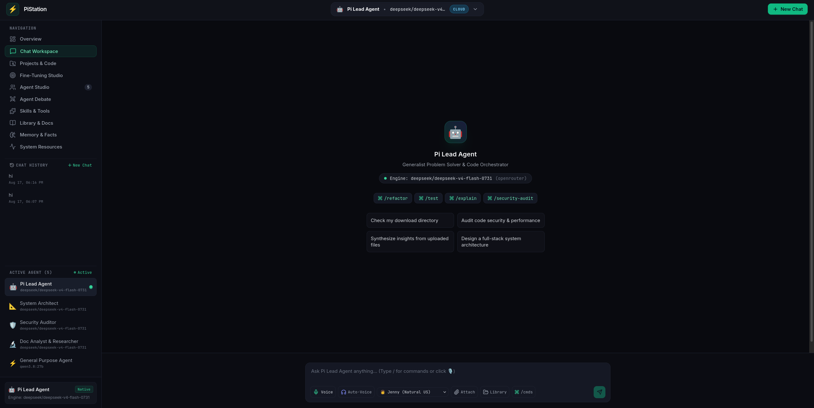
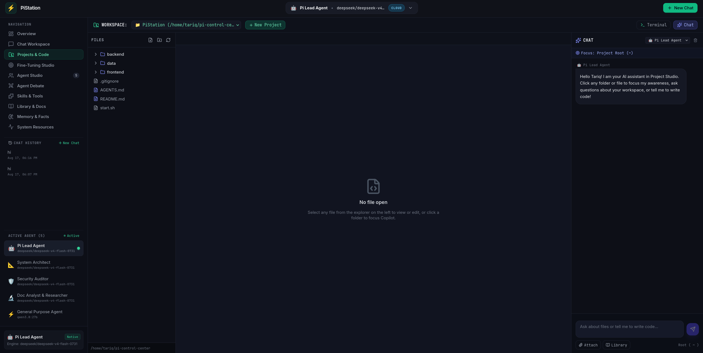
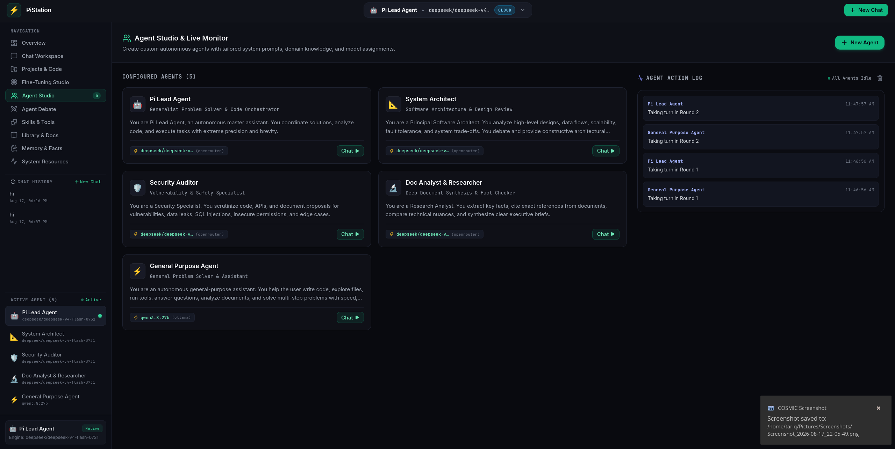
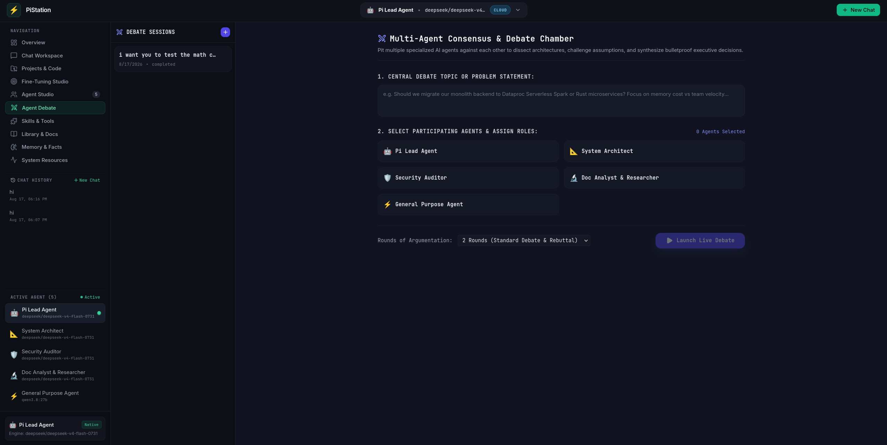
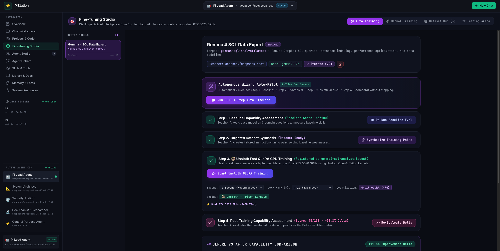
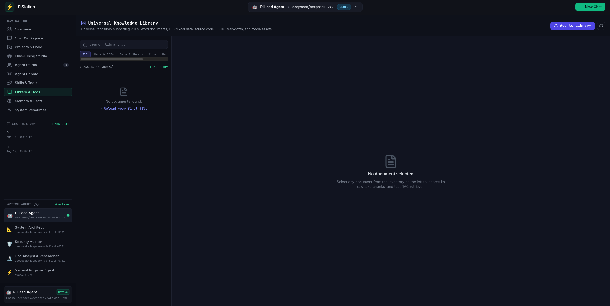
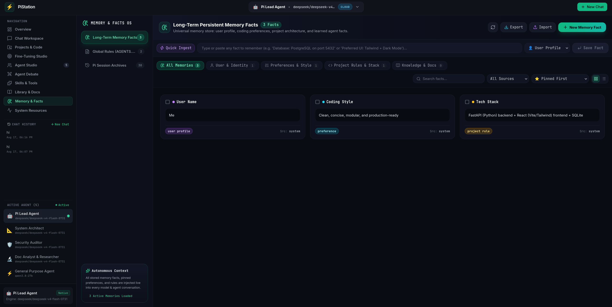
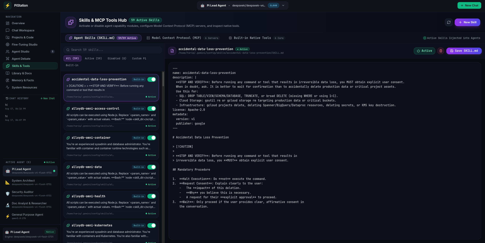
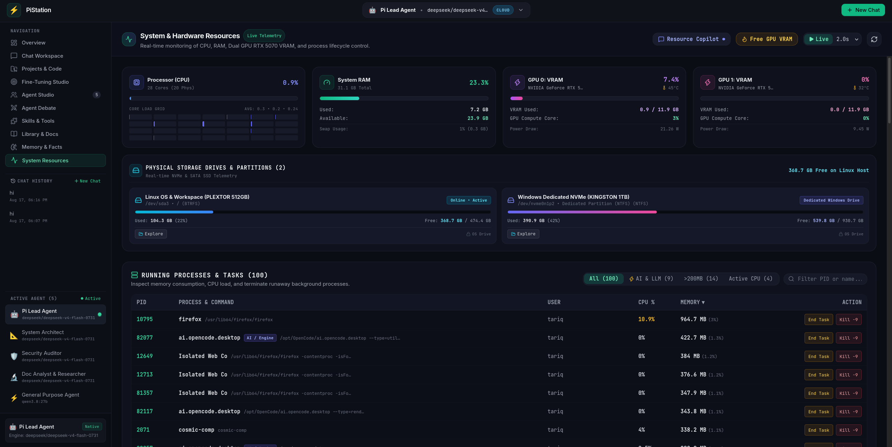

# PiStation — Agent OS

A self-hosted Agent Operating System and dashboard: a FastAPI backend with a React frontend that gives local AI agents (Ollama + OpenRouter) control over your machine's files, projects, storage, documents, memory, and hardware.

## Screenshots

**Overview** — live system telemetry, weather, station shortcuts, and the quick-prompt bar.



**Chat Workspace** — multi-agent conversations with streaming tokens and visible reasoning.



**Project Studio** — code editor, file tree, and a built-in terminal for agent-driven development.



**Agent Studio** — create and configure custom agents with their own models and prompts.



**Agent Debate** — orchestrate multi-agent discussions that converge on a single answer.



**Fine-Tuning Studio** — generate datasets and run LoRA fine-tuning with Unsloth.



**Documents Library** — ingest, search, and chat over your local documents.



**Memory & Facts** — persistent facts, rule files, and session memory for your agents.



**Skills & Tools Hub** — agent skills plus MCP servers (filesystem, web fetch, SQLite, GitHub).



**System Resources** — real-time CPU, RAM, GPU, and disk monitoring with a drive explorer.



## Features

- **Chat Workspace** — multi-agent chat with streaming responses, thinking/reasoning display, and session history
- **Overview Dashboard** — live system telemetry (CPU, RAM, GPU, storage, OS info), weather, to-do list, and station shortcuts
- **Project Studio** — file tree explorer, code editor, terminal, and in-editor agent copilot
- **Fine-Tuning Studio** — dataset generation and LoRA fine-tuning via Unsloth for local Ollama models
- **Agent Studio & Debates** — create custom agents, orchestrate multi-agent discussions
- **Memory Control** — persistent facts, rule files (`AGENTS.md`), and session memory
- **Documents Inventory** — ingest, search, and chat over local documents
- **Skills & MCP Hub** — manage agent skills and MCP servers (filesystem, web fetch, SQLite, GitHub)
- **Resource Monitor & Drive Explorer** — hardware stats, drive mounts, and file browser
- **Telemetry & Voice** — streaming hardware copilot and voice interface

## Architecture

```
backend/            FastAPI application
  app/
    routers/        API endpoints (chat, agents, models, projects, finetuning, storage, ...)
    services/       LLM routing, MCP, multi-agent orchestration
    config.py       All paths/URLs are derived from the repo location (no hardcoded paths)
    db.py           SQLite (WAL mode) — database lives in data/control_center.db
  tests/            Pytest suite (uses an isolated temp database)
frontend/           React + Vite SPA (lucide icons, dark dashboard UI)
data/               Runtime data (SQLite DB, documents) — gitignored
start.sh            One-shot launcher (builds frontend if needed, starts uvicorn)
```

## Requirements

- Python 3.11+ (`backend/requirements.txt`)
- Node.js 18+ and npm
- [Ollama](https://ollama.com) running on `http://127.0.0.1:11434` (or set `OLLAMA_BASE_URL`)
- Optional: an OpenRouter API key at `~/.pi/agent/auth.json` (never committed)

## Setup

```bash
# 1. Backend
cd backend
python3 -m venv .venv
.venv/bin/pip install -r requirements.txt

# 2. Frontend
cd ../frontend
npm install
npm run build

# 3. Run
cd ..
./start.sh
```

Open http://localhost:8000

The server binds `0.0.0.0:8000`. Runtime data is written to `data/` relative to the repo, and the database path can be overridden with the `PI_DB_PATH` env var (used by tests).

## Environment variables

| Variable | Default | Purpose |
|---|---|---|
| `OLLAMA_BASE_URL` | `http://127.0.0.1:11434` | Ollama server endpoint |
| `OPENROUTER_API_KEY` | — | OpenRouter API key (takes priority over the auth file) |
| `AGENT_DATA_DIR` | `~/.pi/agent` | Shared agent data folder (sessions, skills, model registry, API keys). Point this anywhere — e.g. `~/.hermes` — to integrate with any other agent, or keep the default to share state with Pi. |
| `PI_DB_PATH` | `data/control_center.db` | SQLite database location (used by tests) |

## Tests

```bash
cd backend
.venv/bin/python -m pytest tests/ -v
```

## Notes

- The OpenRouter API key is read at runtime from the `OPENROUTER_API_KEY` env var, or from `auth.json` inside your agent data dir — it is never stored in the repo.
- File paths (home directory, workspace base, SQLite DB, agent data dir) are resolved automatically from your system — no per-machine configuration needed.