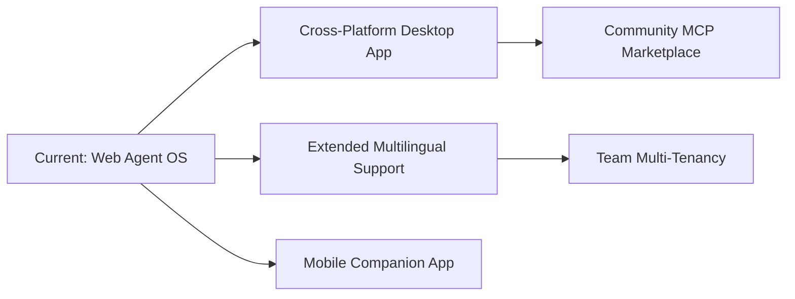

<div align="center">

# ⚡ PiStation — Autonomous Agent Operating System

**A self-hosted, production-ready AI workstation & autonomous agent orchestration platform for Linux, edge servers, and developer workstations.**

[](LICENSE)
[](README.md)
[](https://python.org)
[](https://fastapi.tiangolo.com)
[](https://reactjs.org/)
[](https://vitejs.dev/)
[](https://ollama.com)
[](https://openrouter.ai)
[](https://tailwindcss.com)

<br/>

[Overview](#-overview) •
[Key Features](#-key-features) •
[Bilingual Arabic Support](#-first-class-arabic--rtl-support) •
[Roadmap & Future](#-roadmap--future-horizons) •
[System Architecture](#-system-architecture) •
[Quick Start](#-quick-start) •
[Configuration](#-configuration--environment-variables)

</div>

---

## 🚀 Overview

**PiStation** transforms any modern workstation, edge device, or server into a private, unified **Autonomous AI Agent Operating System**. It unifies local offline inference (via **Ollama**) with cloud foundation models (**OpenRouter**, **Anthropic**, **OpenAI**), pairing them with real-time multi-agent debate chambers, an in-browser code studio with interactive bash terminals, universal document RAG indexing, persistent neural memory facts, Unsloth LoRA fine-tuning, Model Context Protocol (MCP) tooling, and hardware telemetry.

Whether running fully air-gapped on private hardware or leveraging frontier cloud models, PiStation provides a seamless, developer-centric environment for building, evaluating, and operating autonomous multi-agent workflows.

---

## ✨ Key Features

### 🇸🇦 First-Class Arabic & RTL Support (دعم كامل للغة العربية)
* **100% Native Arabic Localization**: Complete translations across all 10 core studios, navigation bars, modals, tooltips, and interactive components.
* **Bi-directional Layout (RTL / LTR)**: Instant toggle between English and Arabic with full Right-to-Left (RTL) styling and layout alignment.
* **Curated Arabic Neural Voices**: 6 regional Arabic voice profiles (Saudi `حامد` & `زارية`, Egyptian `شاكر` & `سلمى`, Emirati `حمدان` & `فاطمة`) for text-to-speech audio playback.
* **Arabic Persona Prompts & Suggestions**: Cultural and linguistic alignment for agent personas, starter prompts, and debate deliberations.
* **Hands-Free Arabic Dictation**: Real-time voice-to-text in Arabic and English across Chat, Projects Copilot, and Supervisor Interventions.

### ⚔️ Executive Arena & Multi-Agent Deliberation
* **Structured Round-Table Debates**: Configure specialized debaters (e.g. Lead Architect, Security Auditor, Pragmatic Skeptic).
* **Live Stance & Rebuttal Parsing**: Real-time extraction of agent agreement (`مُوافق`), dissent (`مُعارض`), partial compromise (`موافق جزئياً`), and team consensus score (0–100%).
* **Autonomous Speech Synthesis**: Sequential neural voiceover with distinct voice personas for each participating agent.
* **Supervisor Live Interventions**: Inject human guidance mid-debate, attach technical specifications on the fly, or dictate instructions hands-free via real-time speech-to-text.
* **Dynamic Executive Verdict**: Real-time structured outcome synthesis automatically saved to persistent memory facts.

### 💬 Chat Workspace & Reasoning Visualizer
* **Streaming Multi-Model Chat**: Chat with any local or cloud LLM with visible `<think>` chain-of-thought introspection.
* **Multi-Engine Support**: Seamlessly switch between DeepSeek-V3/R1, Qwen 2.5/3, Llama 3.3, Claude 3.7, and GPT-4o.
* **Slash Commands**: Quick workflow shortcuts (`/search`, `/debate`, `/project`, `/code`) for automated actions.
* **Bi-Directional Voice Interaction**: Real-time microphone dictation (Web Speech + Whisper fallback) and neural text-to-speech audio streaming.

### 💻 Project Studio & Terminal Copilot
* **In-Browser IDE**: Interactive file tree explorer, Monaco syntax-highlighted code editor, and built-in live bash terminal.
* **Context-Aware Agent Copilot**: Select files, request code refactoring, generate unit tests, and execute bash commands directly within the workspace.

### 📚 Universal Knowledge Library & RAG
* **Multi-Format Ingestion**: Ingest and parse PDFs, Word documents, Markdown, source code, CSV/Excel data, and JSON files.
* **Vector Chunking & Similarity Inspection**: Real-time semantic search tester with similarity score inspection and chunk visualization.
* **Scalable Modal Picker**: Browse and filter through 100+ documents with instant keyword search and direct upload integration.

### 🧠 Persistent Neural Memory & Facts
* **Structured Facts Storage**: Store permanent user preferences, architectural rules, and project decisions in SQLite.
* **Automatic Fact Extraction**: Automatically learns new facts from completed chats and debate verdicts.
* **System Prompt Injection**: Directly compiles active facts into agent system prompts for zero-forgetting workflows.

### 🎛️ Agent Studio
* **Custom Persona Designer**: Assign custom names, avatars, roles, system prompts, default temperatures, and model endpoints.
* **Dynamic Provider Routing**: Seamlessly route agents between local Ollama instances and cloud providers with automatic offline failover.

### 🎯 LoRA Fine-Tuning Studio
* **Automated Dataset Generation**: Generate domain-specific instruction-response training pairs from your knowledge documents.
* **Unsloth LoRA Workflows**: Configure rank, alpha, learning rate, and batch size for GPU/CPU training, with one-click export to Ollama.
* **Testing & Benchmark Arena**: Side-by-side prompt testing between baseline models and fine-tuned checkpoints.

### 🛠️ Skills & Model Context Protocol (MCP) Hub
* **Tool Extensibility**: Equip agents with filesystem access, web fetchers, SQLite query tools, GitHub integrations, and custom terminal command runners.
* **Active Status Toggles**: Enable or disable specific skills dynamically without restarting services.

### 📊 System Telemetry & Drive Explorer
* **Live Hardware Monitor**: Real-time CPU core matrix, RAM utilization, Dual GPU RTX 5070 VRAM usage, power draw, and temperature gauges.
* **Physical Drive Explorer**: Mount detection, storage analysis, and safe USB unmounting across internal NVMe, SATA, and external USB drives.
* **Process Lifecycle Manager**: Inspect process memory/CPU consumption with one-click graceful (`SIGTERM`) and force (`SIGKILL`) termination.

---

## 🗺️ Roadmap & Future Horizons

We have an active development roadmap to expand PiStation into a comprehensive multi-platform AI ecosystem:



### 🖥️ 1. Cross-Platform Desktop Application
* **Native Desktop Shell**: Standalone desktop app powered by **Tauri / Electron** for **Linux (.deb, AppImage, RPM)**, **macOS (.dmg, Apple Silicon/Intel)**, and **Windows (.exe, MSIX)**.
* **System Tray & Global Hotkeys**: Quick summons with global shortcut (`Alt + Space` / `Cmd + Shift + P`) for instantaneous agent prompt injection.
* **Offline Background Daemons**: Embedded local server runner requiring zero terminal interaction from end-users.

### 🌍 2. Expanded Multilingual Support
* **Multi-Language Roster**: Expanding beyond English and Arabic to **Spanish, French, German, Japanese, and Chinese (Simplified & Traditional)**.
* **Community i18n Translation Engine**: Pluggable translation dictionary allowing users and developers to contribute regional dialects and translations.
* **Multi-Lingual Voice Synthesis**: Expanding curated neural voice catalogs for all supported languages.

### 📱 3. Mobile & Remote Companion App
* **Progressive Web App (PWA) & Mobile Client**: Responsive mobile experience to monitor long-running agent tasks, review debate outcomes, and approve tool actions on the go.
* **Push Notifications**: Live alerts when fine-tuning jobs finish, agent debates conclude, or system hardware thresholds (temperature/VRAM) are reached.

### 🔌 4. Community MCP & Skill Marketplace
* **One-Click Tool Installation**: Discover, install, and update community Model Context Protocol (MCP) servers with a single click.
* **Dockerized Safe Sandbox**: Run third-party MCP servers in lightweight, isolated Docker containers with granular permissions.

### 👥 5. Collaborative Team Workspaces & Multi-Tenancy
* **Shared Knowledge Vaults**: Team document repositories with role-based access control (RBAC).
* **Multi-User Agent Sessions**: Collaborative debriefing where multiple engineers participate in the same live agent deliberation chamber.

---

## 🏗️ System Architecture

```
pi-control-center/
├── backend/
│   ├── app/
│   │   ├── main.py                  # FastAPI application entrypoint & middleware
│   │   ├── config.py                # System-relative path & environment configurations
│   │   ├── db.py                    # SQLite (WAL mode) database lifecycle
│   │   ├── routers/
│   │   │   ├── chat.py              # Chat sessions, multi-agent debates & streaming SSE
│   │   │   ├── agents.py            # Agent CRUD, roster management & activity logging
│   │   │   ├── documents.py         # Knowledge ingestion, parsing, chunking & search
│   │   │   ├── memory.py            # Long-term memory facts & profile rules
│   │   │   ├── projects.py          # Project file tree, file edit & terminal execution
│   │   │   ├── finetuning.py        # Dataset synthesis & Unsloth training jobs
│   │   │   ├── telemetry.py         # Hardware telemetry, CPU/GPU/RAM metrics & storage
│   │   │   ├── skills.py            # Skills registry & MCP tool execution
│   │   │   └── voice.py             # Speech-to-Text transcription & TTS audio streaming
│   │   └── services/
│   │       ├── llm_router.py        # Unified streaming router (Ollama + OpenRouter + Anthropic)
│   │       ├── multi_agent_orchestrator.py # Round-table coordinator & stance parser
│   │       └── doc_indexer.py       # Vector embeddings & document text extraction
│   └── requirements.txt             # Python backend dependencies
├── frontend/
│   ├── src/
│   │   ├── App.jsx                  # Main application state & tab coordinator
│   │   ├── context/
│   │   │   └── LanguageContext.jsx  # Bilingual English/Arabic & RTL state manager
│   │   ├── i18n/
│   │   │   └── translations.js      # Master bilingual dictionary
│   │   ├── components/
│   │   │   ├── Overview.jsx         # Executive dashboard & telemetry cards
│   │   │   ├── ChatWorkspace.jsx    # Streaming chat with reasoning inspection
│   │   │   ├── ProjectStudio.jsx    # Monaco editor, file tree & terminal
│   │   │   ├── FineTuningStudio.jsx # Dataset builder & LoRA trainer
│   │   │   ├── AgentStudio.jsx      # Agent creation & parameter tuning
│   │   │   ├── AgentDebate.jsx      # Multi-agent debate arena & speech synthesizer
│   │   │   ├── SkillsControl.jsx    # Tool integration & MCP servers
│   │   │   ├── DocumentInventory.jsx# Knowledge library manager & RAG tester
│   │   │   ├── MemoryControl.jsx    # Facts registry & persistent memory
│   │   │   └── ResourceMonitor.jsx  # Hardware statistics & disk explorer
│   ├── package.json                 # Frontend dependencies
│   └── vite.config.js               # Vite build configuration & proxy routing
├── data/                            # Local SQLite database & document storage (gitignored)
└── start.sh                         # Unified one-shot startup script
```

---

## ⚡ Quick Start

### Prerequisites
* **Python 3.11+**
* **Node.js 18+** & **npm**
* **[Ollama](https://ollama.com)** (optional for local offline models)

### 1. Clone the Repository
```bash
git clone https://github.com/tizahranim/pistation.git
cd pistation
```

### 2. Install Backend Dependencies
```bash
cd backend
python3 -m venv .venv
source .venv/bin/activate
pip install -r requirements.txt
```

### 3. Install & Build Frontend
```bash
cd ../frontend
npm install
npm run build
```

### 4. Launch PiStation
```bash
cd ..
chmod +x start.sh
./start.sh
```

Open your browser at **`http://localhost:8000`** 🎉

---

## ⚙️ Configuration & Environment Variables

PiStation works out-of-the-box with zero mandatory configuration. You can customize behavior via `.env` or system environment variables:

| Variable | Default | Description |
| :--- | :--- | :--- |
| `OLLAMA_BASE_URL` | `http://127.0.0.1:11434` | Endpoint for local Ollama models |
| `OPENROUTER_API_KEY` | *None* | OpenRouter API Key for cloud model inference |
| `OPENAI_API_KEY` | *None* | OpenAI API Key for GPT-4o / o-series models |
| `ANTHROPIC_API_KEY` | *None* | Anthropic API Key for Claude 3.5 / 3.7 models |
| `OPENAI_BASE_URL` | `https://api.openai.com/v1` | OpenAI API endpoint override |
| `ANTHROPIC_BASE_URL` | `https://api.anthropic.com` | Anthropic API endpoint override |
| `PI_DB_PATH` | `data/control_center.db` | SQLite database file location |
| `AGENT_DATA_DIR` | `~/.pi/agent` | Shared agent data directory (keys, custom skills) |

---

## 🧪 Testing & Verification

Run the comprehensive backend test suite:

```bash
cd backend
.venv/bin/python -m pytest tests/ -v
```

---

## 📄 License

This project is licensed under the **MIT License** — see the [LICENSE](LICENSE) file for details.

<div align="center">

Built with ❤️ for the open-source AI agent community.

</div>
